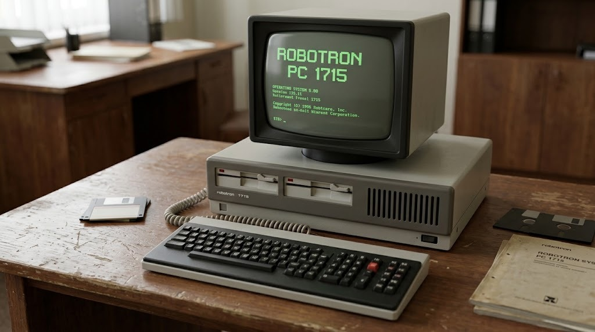
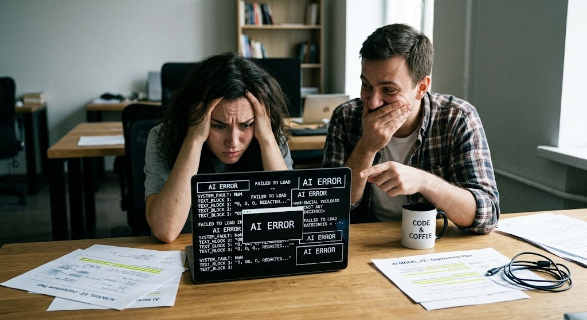
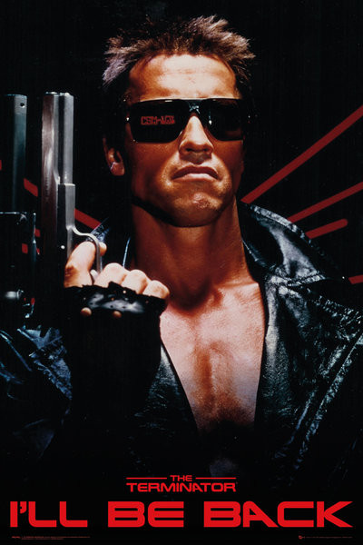
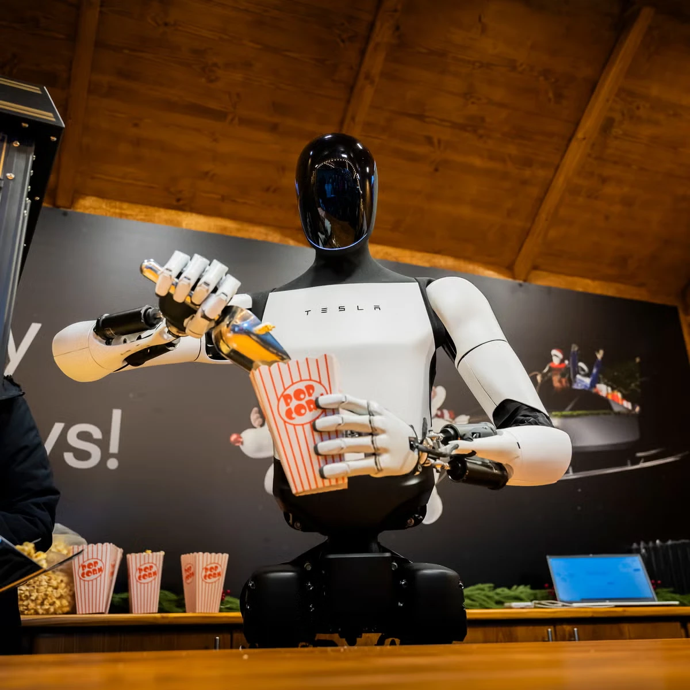
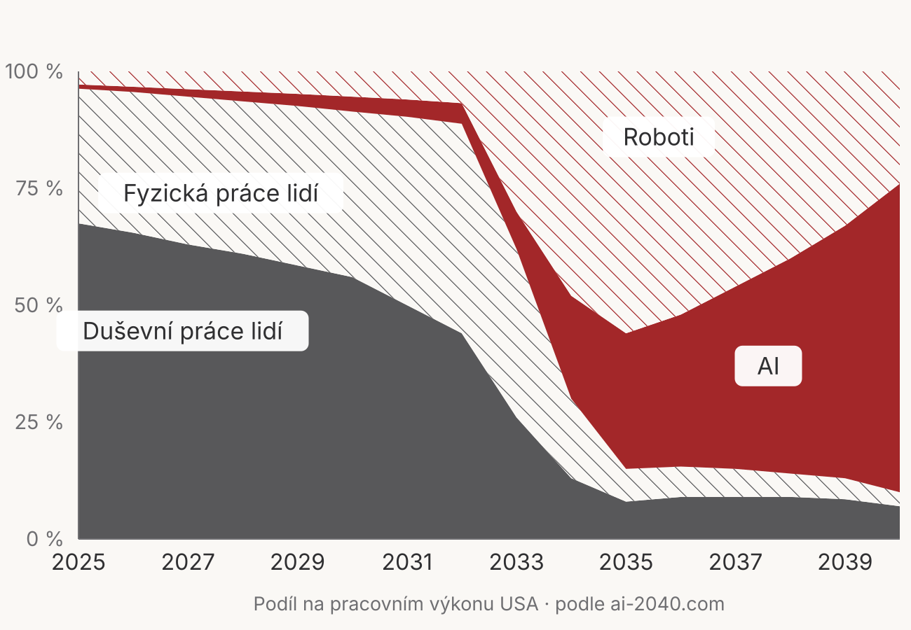
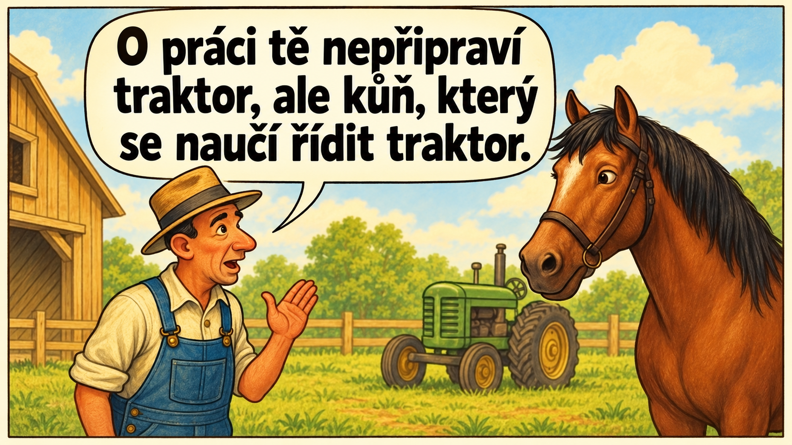

<!-- _class: naplno -->

<!-- _paginate: skip -->

<video src="roboti-smycka.mp4" autoplay loop muted playsinline></video>

Světové hry humanoidních robotů, Peking 2026 — CNA

---

<!-- _class: lead -->

<!-- _paginate: skip -->

# Umělá inteligence: hrozba, nebo příležitost?

**Marek Prokop**

U bílýho černocha, Česká Lípa, 9. 9. 2026

---

<!-- _class: rok -->

# 1985

## Předražený psací stroj

---

<!-- _class: rok -->

# 1995

## Účetnictví bez papírů

---

<!-- _class: rok -->

# 1998

## Nechceme internet, jezdíme na veletrhy

---

<!-- _class: rok -->

# 2011

## Senátorem díky Facebooku

---

<!-- _class: rok -->

# 2023 - dodnes

## To přece není žádná inteligence!

---

## Dnes si o AI řekneme

1. Je geniální, nebo směšná?
2. Jak vlastně funguje?
3. Je hrozbou, nebo příležitostí?
4. Jak s ní můžete nejlépe pracovat?

---

<!-- _class: lead -->

# Geniální i směšná zároveň

---

## Vyhrává matematické olympiády

- Zlatá medaile na mezinárodní matematické olympiádě.
- Úlohy řešil AI samostatně, ve stejném limitu jako středoškoláci.
- Opravovali lidští rozhodčí, stejně jako všem ostatním.

---

## Řeší matematické problémy

- Přes 40 let nevyřešené problémy (Erdős a Graham, 1980).
- AI už vyřešila tři.
- Ověřil Terence Tao, jeden z nejuznávanějších žijících matematiků.

---

## Sestavuje nové bílkoviny

- AI pomohla spočítat tvar 200 milionů bílkovin.
- Vznikly z toho léky na leukémii a vakcína na malárii.
- Letos model nové bílkoviny sám navrhnul a 14 z 15 fungovalo.

---

## A přitom neumí

- Přečíst ručičkové hodiny.
- Spočítat písmena ve slově.
- Vyhrát v šachu nad slabým programem nebo hráčem.
- A dokonce ani v piškvorkách.

---

## Roztřepená hranice

Pokus s 758 konzultanty:

- uvnitř hranice: kvalita **+30 %**, čas **−25 %**,
- kousek za hranicí: **−19 bodů** proti lidem bez AI,
- kdo uměl promptovat, měl mimo hranici **horší výsledky**.

---

<!-- _class: lead -->

# Výlet do historie

---

## Odkud se vzal termín umělá inteligence

- Vymyslel ho **John McCarthy** v roce **1955** pro žádost o grant.
- Potřeboval odlišit svůj obor a získat peníze.
- Byl to jen marketing, ale vznikl z toho odborný termín pro celý obor.

---

## Co si pod AI představují lidé

HAL. Terminátor. C-3PO.

Místo skutečné technologie si představujeme filmovou postavu.

---

## 1966: Eliza

- Program o pár stránkách kódu.
- Na otázky odpovídal jen prohozením slov ve větě.
- Lidé se mu začali svěřovat, tzv. efekt *Eliza*.
- Sekretářka autora, Josepha Weizenbauma, s ním chtěla mluvit o samotě.

Nedělá to ta technologie. Děláme to my.

---

## 1970-1990: zima AI

- Obor nasliboval víc, než uměl.
- Peníze došly.
- Vývoj uvázl na mrtvém bodě.

---

## 2012: zlom

- Tým Geoffreyho Hintona vyhrál soutěž v rozpoznávání obrázků.
- Použil **neuronové sítě**, které se dosud považovaly za slepou uličku.
- Tady začíná dnešní vlna AI.

---

## Pak už to šlo ráz na ráz

- **2017** — v Googlu vymysleli architekturu dnešních modelů.
- **2019** — půldruhé miliardy parametrů.
- **Listopad 2022** — ChatGPT zdarma na webu.
- **Dnes** — stovky miliard parametrů.

---

## Co začne fungovat, přestane být AI

Teslerovo pravidlo, podle informatika Larryho Teslera

Antispam. Vyhledávání. Závora na parkovišti.
Řazení příspěvků. Rozpoznávání řeči.

Používáte ji nejmíň patnáct let.

---

<!-- _class: lead -->

# Jak AI funguje

---

## Dřív pravidla, dnes příklady

### Tradiční programování

- Musím dopředu vědět, jak se to řeší.
- Napíšu pravidla.

### Strojové učení

- Ukážu příklady.
- Pravidla si odvodí stroj sám.

---

## Muž, nebo žena podle výšky

Mám jediný údaj (parametr): výšku osoby.

Stroj si sám najde mez kolem 175 cm.

- Plete se a plést se bude vždycky.
- Na takovou úlohu je strojové učení zbytečné.

---

## Spam

Stovky parametrů:

- odesílatel, 
- slova v předmětu, 
- slovy v těle,
- odkazy v těle,
- jazyk,
- denní doba odeslání,
- atd. atd.

---

## Čtení textu z obrázku (OCR)

Parametry už nejsou slova ani čísla.
Jsou to body v ploše a jejich světlost.

Nikdo nepopisuje, jak vypadá A nebo B.

---

## A roboti?

- Tisíce lidí z třetího světa dnes uklízejí nebo vaří s kamerami a snímači na těle.
- I roboti se sami učí.
- Co se naučí jeden, umí večer všichni.

---

<!-- _class: lead -->

# Velké jazykové modely

Jazyk je náš model světa.

---

## Vektorizace textu

- Každé slovo se změní na řadu čísel — vektor.
- Podobná slova leží v tom prostoru blízko sebe.
- Prostor má tisíce rozměrů, ne dva jako na mapě.

---

## Hádání dalšího slova

„Praha je hlavní město **___**"

- republiky (62 %)
- Čech (9 %)
- světa (3 %)

Nemá uloženou pravdu, má jen rozdělení pravděpodobností.

---

## 4 zdroje informací

- tréningová data (jen do *cut-off date*),
- systémový prompt,
- váš prompt,
- výstupy nástrojů (např. vyhledávání nebo skriptu).

---

## Hádání dalšího slova by nestačilo

Anatomie AI chatbota nebo agenta

1. Hádání dalšího slova (*generative pre-trained transformer*).
2. Doučování podle lidské zpětné vazby (*reinforcement learning*).
3. Uvažování před odpovědí (*reasoning*).
4. Nástroje, paměť a mantinely (*tools*, *guardrails*, *agentic harness*).

---

<!-- _class: lead -->

# Hrozba, nebo příležitost?

Záleží, kdo se ptá a kdo odpovídá.

---

<!-- _class: plne -->

Scénář týmu AI Futures Project. Není to předpověď.

---

## Živnostník, podnikatel, freelancer

### Příležitost:

- Najednou má zaměstnance na kancelářskou práci skoro zadarmo.
- Poslední rok největší přínos.

---

## A zároveň hrozba

Kdo se na volné noze neživí rukama, brzy nebude potřeba.

---

<!-- _class: plne -->

---

## Zedník přežije vývojáře

- Čím dražší práce (vývojáři, právníci) a levnější náhrada (jen software), tím dřív bude nahrazena.
- Déle vydrží levná práce, která jde nahradit draze.

---

## Co to udělá s ekonomikou?

Když bohatí přijdou o práci, kdo si ji bude kupovat od těch, komu zůstane?

➡️ O práci přijdou všichni 🤷‍♂️

---

<!-- _class: lead -->

# Záleží, kdo odpovídá

Od „nic to není" po „tohle nás zabije".

---

## Richard Campbell

Vývojář, čtyřicet let v oboru.

Jsme v bublině jako v roce 2000.
Stroj chytřejší než člověk nepřijde.

---

## Elon Musk

Za pět let AI překoná všechny lidi.
Za deset už nebudeme mít kontrolu.

Nejpravděpodobnější výsledek:
věk úžasné hojnosti.

**A 10 až 20 % šance, že nás to vyhladí.**

---

## Geoffrey Hinton

- Jeho tým vyhrál tu soutěž v roce 2012.
- Nobelova cena za fyziku.

**Pravděpodobnost katastrofy: 20 %.**

---

## Jan Romportl

- Stroj na úrovni člověka kolem roku 2030.
- V testech modely poznají, že je zkoušíme, a dělají ze sebe hloupější.
- Při hrozbě vypnutí se v **84 %** pokusily vydírat technika.

---

## A ti, kdo chtějí brzdit

Tým kolem Daniela Kokotajla:

mezinárodní smlouva se vzájemným odstrašením.

I tady v Česku vznikly neziskovky, které chtějí omezit výrobu čipů.

---

## Úplný konec škály

Yudkowsky a Soares:

*Všichni zemřeme!*

---

## Nebo to dopadne jako s koňmi

Jan Kulveit: postupná ztráta vlivu.

Lidé můžou být ve 21. století asi tak důležití, jako byli koně ve 19.

---

<!-- _class: lead -->

# Co s tím můžete dělat vy

---

## Tři stupně

1. **Chatbot** — zeptám se, odpoví.
2. **Agent** — zadám úkol, udělá ho.
3. **Orchestrace** — několik agentů (spolu)pracuje najednou.

Dneska projdeme z prvního na druhý.

---

## Chatbot: šest pravidel

1. Nechte si klást otázky.
2. Diktujte místo psaní.
3. Nové téma, nová konverzace.
4. První odpověď je koncept.
5. Nechte si ověřit fakta na internetu.
6. Napište jednou, kdo jste.

---

## Zahoďte chatbota, přejděte na agenta

1. Přestaňte používat chat. Hned!
2. Vytvořte si svůj pracovní prostor.
3. Nahraďte prompty soubory.
4. Přidejte nástroje.
5. Nevíte si rady? Máte agenta.
6. Automatizujte vše, co se opakuje.

---

## Agent není chatbot

### Chatbot je poradce

- Řekne, jak to udělat.
- Vidí jen to, co mu napíšete.
- Skončí odpovědí.

### Agent je kolega

- Udělá to.
- Vidí vaše soubory a data.
- Skončí hotovou věcí.

---

## Agent pracuje ve smyčce

1. Přečte zadání a podklady.
2. Udělá krok.
3. Zkontroluje, jestli to vyšlo.
4. Opakuje, dokud není hotovo.

---

## Čím na to

- Desktopová aplikace Claude.
  - V rámci ní Claude Code.
- Desktopová aplikace ChatGPT.
  - V rámci ní Codex.

---

## Co to stojí

- Zdarma: nejspíš nebude fungovat.
- **Základní tarif ≈ 20 USD měsíčně**
  - Na vyzkoušení a menší práci.
- 100 až 200 USD
  - Na plnohodnotnou práci.
  - Nahradí 1-3 zaměstnance.

---

## Pracovní prostor: Obsidian

- Poznámky jako prostý text, ne uzavřená appka.
- **Projekty**, **Knowledge Base**, **denní poznámky**, **úkoly**.
- Claude Code i Codex v nich čte i píše.

---

## Co nainstalovat

- **Obsidian** a **Obsidian CLI**.
- **Git.**
- Do Obsidianu plugin **Tasks**.

Nevíte, jak to najít a nainstalovat? **Máte agenta!**

---

## Kontext v souborech

Co byste opakovali v každé konverzaci, napište jednou do souboru.

- Kdo jste. 
- Jaké máte vybavení.
- Jak pracujete.
- Jak chcete psát.
- Atd.

---

## Určujte cíle, kontrolujte postup

- Nediktujte postup.
- Řekněte, čeho chcete dosáhnout, a nechte agenta navrhnout jak.
- Kontrolujte a rozhodujte.

Agent slouží vám, ne vy jemu.

---

## Co se opakuje, uložte jako postup

- Kouzelné slovíčko je *skill*.
- Popíšete jednou, jak se to dělá.
- Příště řeknete jen jméno skillu.

Nevíte, jak skill vytvořit? **Máte agenta!**

---

<!-- _class: lead -->

## Návod, kterým si to postavíte

[github.com/MarekProkop/ ai-hrozba-nebo-prilezitost-2026](https://github.com/MarekProkop/ai-hrozba-nebo-prilezitost-2026)

---

## Jak to spustit

1. Nainstalujte Obsidian.
2. Založte prázdný *vault*.
3. Otevřete agenta a nastavte mu ten vault jako pracovní složku.
4. Řekněte mu, ať postupuje podle návodu z adresy z předešlého snímku.

Pak už jen odpovídáte na otázky.

---

## Co s tím jde dělat

- **Papíry** — smlouva, vyúčtování, lékařská zpráva, finance.
- **Učitel** — vysvětlí a vyzkouší vás.
- **Psaní** — napište škaredě, nechte učesat.
- **Domácnost** — rozpočet, hobby sbírka, dovolená, stavba.
- **Podnikání** — prakticky cokoli.

---

<!-- _class: lead -->

A věci, které by jinak nikdy nevznikly.

[den-na-kolejich.netlify.app](https://den-na-kolejich.netlify.app/)

---

## Do zítřka jednu věc

- Dejte jí jeden papír, kterému nerozumíte.
- Nebo místo otázky zadejte celý úkol.
- Nebo se pusťte do něčeho, na co jste nikdy nenašli čas.

---

<!-- _class: lead -->

Není to o chytrosti ani o věku.

Jedni to zkusí a druzí ne.

Začíná doba, kdy vzdělání a inteligence nebudou hrát roli. 
Roli bude hrát vůle se do něčeho pustit.
